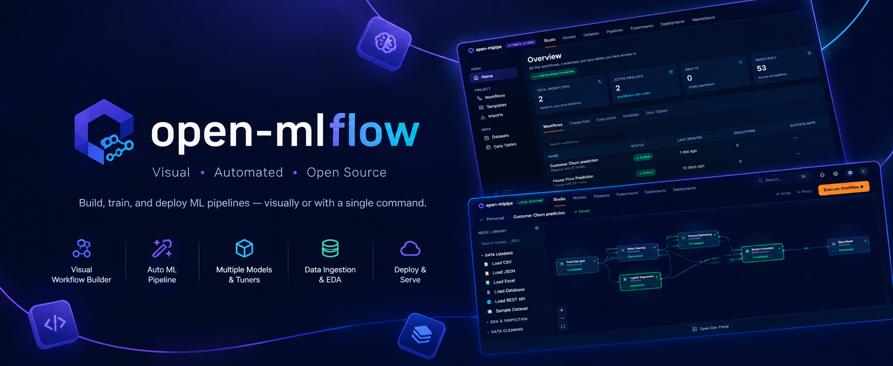
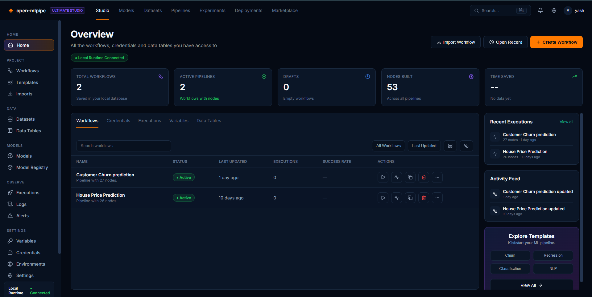
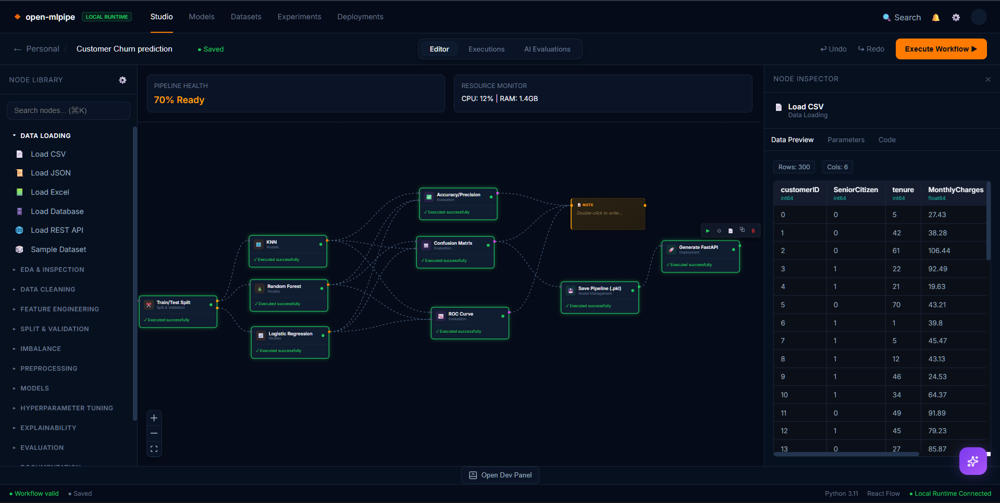

<div align="center">
  
</div>

<div align="center">

# 🧬 OpenML Flow

### The Local-First Visual Machine Learning IDE

[](https://github.com/loisekk/openml-flow/blob/main/LICENSE)
[](https://github.com/loisekk/openml-flow/releases)
[](https://hub.docker.com/u/loisekk)
[](https://www.python.org/)
[](https://react.dev/)
[](https://fastapi.tiangolo.com/)
[](https://www.typescriptlang.org/)
[](https://github.com/loisekk/openml-flow/stargazers)

Build, train, evaluate, and deploy complete machine learning pipelines visually. OpenML Flow combines the workflow automation of n8n with the deep technical capabilities of a dedicated ML IDE like VS Code or JupyterLab.

[🚀 Quick Start](#-quick-start-docker) • [✨ Key Features](#-key-features) • [🏗️ Architecture](#-architecture) • [🗺️ Roadmap](#-roadmap) • [🤝 Contributing](#-contributing)

</div>

<br>

## 📖 Overview

OpenML Flow is not just another node-based automation tool; it is a dedicated engineering environment for Machine Learning. It bridges the gap between visual pipeline building and raw, code-level control.

Instead of locking users into a rigid UI, OpenML Flow provides a visual graph that generates clean, executable Python code in real-time. Users can inspect data, install packages, execute nodes individually, and monitor local compute resources — all within a premium, dark-themed interface.

### Why OpenML Flow?

| | OpenML Flow | Typical Node Tools (n8n-style) | Notebooks (Jupyter) |
|---|:---:|:---:|:---:|
| 🧩 Visual pipeline building | ✅ | ✅ | ❌ |
| 🐍 Clean, editable Python codegen | ✅ | ❌ | ⚠️ Manual |
| 🖥️ Full IDE per node (Monaco) | ✅ | ❌ | ⚠️ Limited |
| 🔒 Local-first execution | ✅ | ⚠️ Often cloud-bound | ✅ |
| 🚀 One-click API deployment | ✅ | ❌ | ❌ |
| 🤖 AI copilot with workflow context | ✅ | ⚠️ | ⚠️ |

- **Local-First** — All computation, data processing, and model training happen on your machine. No cloud GPU bills, no data leakage.
- **Code Transparency** — The visual graph is the source of truth, but it generates clean pandas and scikit-learn Python code that you can edit directly in the built-in Monaco editor.
- **BYOK AI Assistant** — Integrated AI copilot that understands your workflow context. Bring your own API keys (OpenAI, Groq, Ollama) — no middleman fees.

<br>

## 🖼️ The Interface

### 📊 Studio Dashboard

Your mission control — manage workflows, credentials, executions, variables, and data tables. Track recent executions, monitor the activity feed, and kickstart projects from ready-made templates (Churn, Regression, Classification, NLP).

<div align="center">
  
</div>

### 🧩 Visual Pipeline Canvas

Drag nodes from the categorized library, wire them up, and execute. Every node ships with a built-in Node Inspector — live data previews, parameter editing, and generated code side-by-side. Pipeline health scoring and a real-time CPU/RAM resource monitor keep you informed at every step.

<div align="center">
  
</div>

### 📚 Built-in Node Library

| Category | Nodes |
|---|---|
| Data Loading | Load CSV, JSON, Excel, Database, REST API, Sample Datasets |
| EDA & Inspection | Statistical summaries, distributions, data previews |
| Data Cleaning | Missing values, outliers, deduplication |
| Feature Engineering | Encoding, scaling, transformations |
| Split & Validation | Train/Test Split, K-Fold, Stratification |
| Imbalance | SMOTE, undersampling, class weighting |
| Models | Logistic Regression, Random Forest, KNN, and more |
| Hyperparameter Tuning | Grid Search, Random Search, Optuna |
| Explainability | Feature importance, SHAP |
| Evaluation | Accuracy/Precision, Confusion Matrix, ROC Curve |
| Deployment | Save Pipeline (.pkl), Generate FastAPI service |

<br>

## 🚀 Quick Start (Docker)

Run the entire platform locally in 30 seconds. No need to clone the source code.

**1.** Create a new, empty folder on your machine and open a terminal in it.

**2.** Save the following code as `docker-compose.yml`:

```yaml
services:
  backend:
    image: loisekk/openml-flow-backend:latest
    container_name: openml-flow-backend
    ports:
      - "3001:3001"
    volumes:
      # Mount directories, not files. This prevents the Windows mount bug.
      - ./uploads:/app/uploads
      - ./data:/app/data
    environment:
      - PYTHONUNBUFFERED=1

  frontend:
    image: loisekk/openml-flow-frontend:latest
    container_name: openml-flow-frontend
    ports:
      - "8080:80"
    depends_on:
      - backend
```

**3.** Run the application:

```bash
docker-compose up -d
```

**4.** Access the platform at: **http://localhost:8080** 🎉

> 💡 **Tip:** All your workflows, datasets, and models persist in the mounted `./data` and `./uploads` volumes — safe across restarts and upgrades.

### 🔄 Updating to a New Version

When a new version of OpenML Flow is released, update your local instance without losing your data:

```bash
docker-compose pull
docker-compose up -d --force-recreate
```

<br>

## 🏗️ Architecture

OpenML Flow uses a decoupled architecture with a React frontend communicating with a Python FastAPI backend.

```
┌───────────────────────────────────────────────────────────┐
│                      React Frontend                       │
│      (React 19, Vite, React Flow, Zustand, Monaco Editor) │
└─────────────────────────────┬─────────────────────────────┘
                              │ HTTP / Server-Sent Events (SSE)
┌─────────────────────────────▼───────────────────────────────┐
│                      FastAPI Backend                        │
│             (Python, SQLite, JWT Auth, OpenAI SDK)          │
└────────────────┬──────────────────────────────┬─────────────┘
                 │                              │
                 ▼                              ▼
   ┌────────────────────────┐     ┌──────────────────────────┐
   │ Local Execution Engine │     │     Local AI Gateway     │
   │ (asyncio/subprocess)   │     │(OpenAI API / Local Ollama)│
   └────────────────────────┘     └──────────────────────────┘
```

### 🧱 Tech Stack

| Layer | Technology |
|---|---|
| Frontend | React 19, Vite, TypeScript, React Flow, Zustand, Monaco Editor |
| Backend | Python, FastAPI, SQLite, JWT Auth, OpenAI SDK |
| Execution | asyncio + subprocess sandboxed Python runners |
| AI Gateway | OpenAI, Groq, Ollama (local) — BYOK |
| Deployment | Docker, Docker Compose |

### 📁 Project Structure

```
openml-flow/
├── client/          # React 19 + Vite frontend (TypeScript)
├── server/          # FastAPI backend (Python)
├── workflows/       # Workflow automation & CI scaffolding
├── docker-compose.yml
├── TUTORIAL.md      # Step-by-step tutorial
└── README.md
```

<br>

## 🛠️ Local Development Setup

If you want to contribute to the source code or run the project outside of Docker:

**1. Clone the repository:**

```bash
git clone https://github.com/loisekk/openml-flow.git
cd openml-flow
```

**2. Start the Backend:**

```bash
cd server
python -m venv venv
source venv/bin/activate  # On Windows: venv\Scripts\activate
pip install -r requirements.txt
python main.py
```

Backend runs on `http://localhost:3001`

**3. Start the Frontend:**

```bash
cd client
npm install
npm run dev
```

Frontend runs on `http://localhost:5174` (configured via Vite proxy to route `/api` to backend)

**4. Or run the full stack locally via Docker Compose:**

*(This uses the `docker-compose.yml` in the repository root, which builds from source)*

```bash
docker-compose up -d --build
```

<br>

## ✨ Key Features

- **Visual Pipeline Builder** — Infinite React Flow canvas with categorized ML nodes. Search (⌘K), drag, connect, and execute.
- **Node Studio** — Double-click any node to open a dedicated IDE window. Edit parameters, view input/output data, and modify generated code in Monaco Editor — full transparency, zero black boxes.
- **Local-First Execution** — All Python execution happens securely on your machine via FastAPI subprocess streaming. Execute nodes individually or run the full topological pipeline with live SSE log streaming.
- **BYOK AI Copilot** — Integrated AI assistant that understands your workflow. Supports OpenAI, Groq, and local Ollama — your keys, your models, your data.
- **Integrated Package Manager** — Install any Python library (e.g., `xgboost`) directly from the UI — no shell required.
- **Persistent State** — SQLite database and local volume mapping ensure your workflows and datasets are never lost. Plus a real-time CPU/RAM resource monitor and pipeline health scoring.

<br>

## 🗺️ Roadmap

OpenML Flow is in active development. Here is what's planned for future releases:

| Version | Feature | Status |
|---|---|:---:|
| v1.1 | Advanced Execution Engine — true topological node-by-node execution (passing DataFrames between Python subprocess calls sequentially) | 🚧 In Progress |
| v1.2 | Integrated Terminal — a WebSocket-based terminal in the bottom panel for direct CLI access to the Python environment | 📋 Planned |
| v1.3 | EDA Charts — real-time rendering of histograms, scatter plots, and correlation heatmaps inside the Node Studio | 📋 Planned |
| v1.4 | Model Registry & MLflow Integration — track experiments and version models directly from the visual canvas | 📋 Planned |

💡 Have an idea? [Open a feature request](https://github.com/loisekk/openml-flow/issues/new) — the roadmap is community-driven.

<br>

## 🤝 Contributing

Contributions are welcome! If you'd like to add a new ML node, improve the UI, or fix a bug:

1. Fork the Project
2. Create your Feature Branch (`git checkout -b feature/AmazingFeature`)
3. Commit your Changes (`git commit -m 'Add some AmazingFeature'`)
4. Push to the Branch (`git push origin feature/AmazingFeature`)
5. Open a Pull Request

📖 Check out `TUTORIAL.md` for a guided walkthrough of the platform before diving in.

<br>

## ⭐ Star History
 
<a href="https://www.star-history.com/?type=date&repos=loisekk%2Fopenml-flow" target="_blank">
  
</a>
<br>
## ⭐ Show Your Support
 
If OpenML Flow saves you time, consider giving it a star — it helps others discover the project!
 
<div align="center">
<sub>Copyright © 2026 OpenML Flow</sub>
 
<sub>Made with 🧬 by <a href="https://github.com/loisekk">loisekk</a></sub>
 
**Local-First · Code Transparency · BYOK AI**
 
</div>
## 📄 License
 
Distributed under the MIT License. See `LICENSE` for more information.
 
<br>
